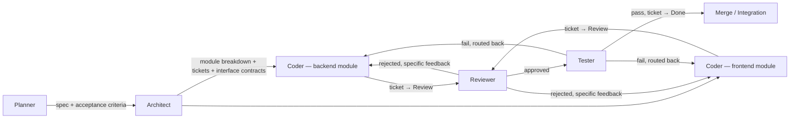

# Agentic SDLC — Technical Documentation

> **Maintenance policy**: this document describes the agentic system itself
> (the `.claude/` scaffold, not the product being built with it). Whenever
> you add/remove/change an agent, skill, hook, or rule file — or change how
> they connect — update the relevant section below **and** add a line to
> the Changelog at the bottom. This file, not tribal knowledge, is the
> source of truth for how the system works.

## 1. Purpose

A stack-agnostic, monorepo-shaped Claude Code agent pipeline for running a
software project's SDLC: idea → spec → architecture → parallel
implementation → review → test → merge. Built to be copied into a real
project once the idea locks; nothing in `.claude/` references a specific
product until placeholders are filled in.

## 2. Repo shape

Monorepo: one git history, no git submodules. Two subfolders, each with its
own nested rules file:

```
backend/CLAUDE.md    — backend stack + coding standards (loaded only for agents working in backend/)
frontend/CLAUDE.md   — frontend stack + coding standards (loaded only for agents working in frontend/)
CLAUDE.md            — shared rules (idea, module list, commit format, shared DoD, Decisions Log)
```

Claude Code auto-loads whichever `CLAUDE.md` is nearest to the files an
agent is touching, so a backend coder agent never sees frontend-only rules
and vice versa. See [`CLAUDE.md`](../CLAUDE.md) §"Repo structure" for the
canonical statement of this.

**Why monorepo over git submodules**: single atomic commit across a
backend/frontend contract change, no pinned-SHA drift, no
`--recurse-submodules` CI overhead. Revisit only if backend/frontend end up
owned by separate teams with independent release cadences — see the
Decisions Log in `CLAUDE.md` for the record of this call.

## 3. The four levers

Every subagent's behavior is shaped by four mechanisms. Know which one to
reach for when changing how an agent behaves:

| Lever | Where it lives | Answers | Scope |
|---|---|---|---|
| **Rules** | `CLAUDE.md`, `backend/CLAUDE.md`, `frontend/CLAUDE.md` | What standards must this output meet? | Read by every agent working in that folder tree |
| **Tools** | `tools:` line in each agent's frontmatter (`.claude/agents/*.md`) | What is this agent *allowed* to call? | Per-agent allowlist |
| **Skills** | `.claude/skills/<name>/SKILL.md` | How is this multi-step procedure done, consistently? | Invoked by name from any agent that needs it |
| **Hooks** | `.claude/settings.json` | What happens automatically on an event? | Fires on tool-use events (file edit, Jira transition, etc.), not agent-specific |

Rule of thumb: a fact/standard → Rules. A permission → Tools. A repeatable
*procedure* multiple agents should do identically → Skills. An automatic
enforcement/side-effect → Hooks.

## 4. Pipeline



Coder agents for independent modules run **in parallel**, one per module,
each scoped to its own file tree and its own Jira ticket. Backend and
frontend modules are always separate tickets/agents, joined only by the
interface contract the Architect writes down.

## 5. Agent roster

| Agent | File | Model | Tools | Role |
|---|---|---|---|---|
| Planner | `.claude/agents/planner.md` | — | Read, Write, Grep, Glob, Jira/Confluence create | Turns raw requirements into a spec + acceptance criteria (Jira Epic + Confluence page) |
| Architect | `.claude/agents/architect.md` | opus | Read, Write, Grep, Glob, Jira/Confluence create+link | Locks stack per side, breaks spec into backend/frontend modules, writes interface contracts, creates nested `CLAUDE.md`s, tickets, and copies coder templates |
| Coder — backend | `.claude/agents/coder-backend-template.md` → copied to `coder-<module>.md` per module | sonnet | Read, Write, Edit, Bash, Grep, Glob, Jira transition/comment | Implements one backend module against its interface contract; file scope `backend/{{FILE_SCOPE}}` only |
| Coder — frontend | `.claude/agents/coder-frontend-template.md` → copied to `coder-<module>.md` per module | sonnet | same as above | Implements one frontend module against its interface contract; file scope `frontend/{{FILE_SCOPE}}` only |
| Coder — generic | `.claude/agents/coder-template.md` | sonnet | same as above | Fallback for modules outside the backend/frontend split (e.g. infra) |
| Reviewer | `.claude/agents/reviewer.md` | opus | Read, Grep, Glob, Bash, Jira comment/transition, Confluence get | Gate before merge: checks acceptance criteria, interface contract adherence, `CLAUDE.md` standards, lint, tests. Writes Decisions Log compaction summaries. |
| Tester | `.claude/agents/tester.md` | sonnet | Read, Bash, Grep, Glob, Jira comment/transition | Runs the actual test suite via `run-backend-tests`/`run-frontend-tests`, routes failures to the exact coder agent responsible |

Coder agents are named `coder-<module>` (not a generic name) so multiple
can be dispatched concurrently without colliding.

## 6. Skills roster

| Skill | Used by | Purpose |
|---|---|---|
| `run-backend-tests` | Coder (backend), Reviewer, Tester | Single shared way to run the backend suite — currently a placeholder command, fill in once stack is locked |
| `run-frontend-tests` | Coder (frontend), Reviewer, Tester | Same, for frontend |
| `open-pr` | Coder agents (post-Review), Integration step | Consistent PR conventions (branch naming, commit format, ticket linking) |

Add a new skill when ≥2 agents would otherwise each improvise the same
multi-step procedure.

## 7. Hooks roster

Defined in [`.claude/settings.json`](../.claude/settings.json):

| Hook | Trigger | Current state | Intended behavior once wired |
|---|---|---|---|
| Lint/format | `PostToolUse` on `Edit\|Write` | Placeholder echo | Dispatch by path (`backend/*` vs `frontend/*`) to the real linter/formatter for that side |
| Test gate | `PreToolUse` on `mcp__atlassian__jira_transition_issue` | Placeholder echo, always allows | Run the relevant `run-*-tests` skill and exit non-zero to block a ticket transition to Review/Done on failing tests |

Both are inert until the stack is locked and the real commands are filled
in (Architect agent does this as part of its process, step 5–6).

## 8. Context engineering summary

- **Global** (`CLAUDE.md`): stable, shared, low-churn — grows only via a
  deliberate Decisions Log entry, never by accumulation.
- **Per-side** (`backend/CLAUDE.md`, `frontend/CLAUDE.md`): stable per side,
  loaded only by agents working in that folder.
- **Per-feature**: lives in the module's Jira ticket + linked Confluence
  page, loaded only by the coder agent working that ticket.
- **Compaction**: on module completion, the Reviewer writes a 2-3 line
  summary into `CLAUDE.md`'s Decisions Log; future agents read the summary,
  not the full ticket history.

Full detail in [`CLAUDE.md`](../CLAUDE.md) §"Context engineering rules".

## 9. Bootstrapping a real project from this scaffold

1. Copy `.claude/`, `CLAUDE.md`, `backend/CLAUDE.md`, `frontend/CLAUDE.md`,
   and this `docs/AGENTIC_SDLC.md` into the real project repo root.
2. Run Planner on the actual idea/requirements.
3. Run Architect: locks stack, fills nested `CLAUDE.md`s, writes interface
   contracts, creates tickets, copies coder templates per module.
4. Fill in `run-backend-tests`/`run-frontend-tests` skill commands and wire
   the `PreToolUse` test-gate hook to them.
5. Dispatch coder agents per module (parallel where independent) → Reviewer
   → Tester → merge.

## Changelog

> One line per change to the scaffold itself. Newest first.

- **2026-09-01** — Initial version: monorepo backend/frontend split (nested
  `CLAUDE.md`s, `coder-backend-template.md`/`coder-frontend-template.md`),
  skills (`run-backend-tests`, `run-frontend-tests`, `open-pr`), test-gate
  hook placeholder added. This document created.
